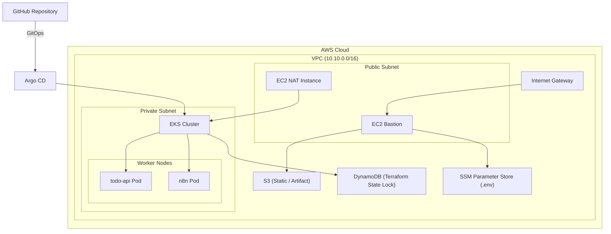

# DevOps Portfolio  
EKS · ECS · Argo CD · n8n · GitHub Actions · Terraform · GitOps

---

## 1. 프로젝트 목표

본 프로젝트는 AWS 환경에서 **GitOps 기반 DevOps 아키텍처를 직접 설계·구현·검증**하는 것을 목표로 한다.

주요 목표는 다음과 같다.

- ToDo 애플리케이션과 n8n(워크플로우 자동화 도구)을 컨테이너화
- AWS EKS(Elastic Kubernetes Service)에 **Argo CD 기반 GitOps 방식으로 배포**
- Git 변경 → 자동 반영, 수동 변경 → 자동 복구가 동작함을 실제로 검증
- 동일 애플리케이션을 AWS ECS(Elastic Container Service) 기준으로도 배포하여
  **EKS와 ECS의 운영 관점 차이를 비교**
- CI/CD, 인프라 자동화, 운영 안정성까지 포함한 DevOps 포트폴리오 구성

---

## 🧱 아키텍처 구성도


## 2. 사용 기술

### Container / Orchestration
- Docker (컨테이너 이미지 빌드)
- Kubernetes

### Cloud (AWS)
- AWS EKS (Elastic Kubernetes Service)
- AWS ECS (Elastic Container Service)
- Amazon EBS + EBS CSI Driver (스토리지)

### GitOps / CI·CD
- Argo CD (Argo Continuous Delivery)
- GitHub Actions (Continuous Integration)

### Infrastructure as Code
- Terraform

### Application
- ToDo API (Node.js)
- n8n (Workflow Automation Platform)

---

## 3. 리포지토리 구조

```text
.
├─ app/                 # 애플리케이션 소스 (ToDo API, n8n)
├─ infra/               # Terraform 인프라 코드
│  └─ terraform/
│     ├─ envs/dev       # Infra Root (VPC, EKS, Node Group)
│     └─ addons/dev     # Add-ons Root (Argo CD, EBS CSI, IRSA)
├─ k8s/                 # Kubernetes 리소스(manifest)
│  └─ envs/dev          # dev 환경 Deployment, Service 등
├─ gitops/              # Argo CD GitOps 리소스
│  └─ argocd/
│     ├─ bootstrap      # apps-root Application
│     └─ apps           # todo-api-dev, n8n Application
├─ docs/                # 아키텍처 및 운영 문서
└─ README.md
```

## 4. Terraform 설계 (Root 분리)
Terraform 구성은 의도적으로 두 개의 Root로 분리하였다.

- Infra Root (`infra/terraform/envs/dev`)
  - VPC
  - EKS Cluster
  - Managed Node Group
  - OIDC Provider

- Add-ons Root (`infra/terraform/addons/dev`)
  - Argo CD (Helm)
  - EBS CSI Driver (EKS Add-on)
  - IRSA (IAM Role for Service Account)

- Root 분리 이유
  - 인프라와 플랫폼(Add-on) 책임 분리
  - 클러스터 재생성 시 애드온 재적용 용이
  - destroy / recreate 시 안정성 확보
  - 실무 DevOps환경의 역할 분리를 반영

## 5. GitOps 아키텍처 (Argo CD)
### App Of Apps 패턴
- apps-root Application이 최상위 컨트롤러 역할
- 하위 Application
  - todo-api-dev
  - n8n
  
이를 통해 여러 애플리케이션을 하나의 진입점에서 선언적으로 관리한다.

### 선언적 배포 원칙
- 모든 Application 설정은 Git에 선언
- Argo CD UI에서의 수동 설정은 사용하지 않음
- UI 변경은 Git 선언이 없을 경우 자동 원복됨
  
Git이 항상 단일 진실 소스 역할을 한다

## 6. GitOps 동작 검증
### Auto Sync (자동 동기화)
- Git에서 Deployment의 replicas 변경
- Sync 버튼 클릭 없이 자동 반영 확인

### Self Heal (자동 복구)
- kubectl로 클러스터에서 수동 변경
- Argo CD가 Git 상태로 자동 복구 확인

### Prune (자동 삭제)
- Git에서 리소스 삭제
- 클러스터에서도 자동 삭제 확인

이를 통해 Git 선언이 항상 최종 상태를 결정함을 검증
