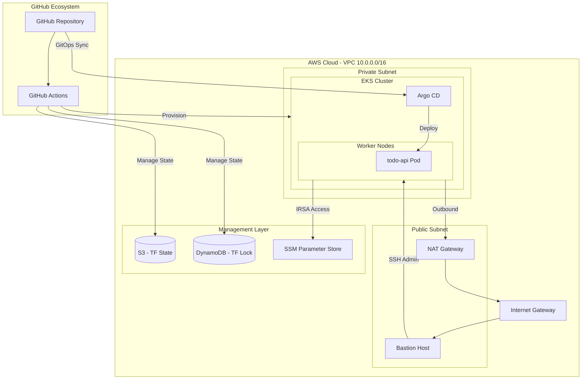

# DevOps Portfolio  
EKS · Argo CD · n8n · GitHub Actions · Terraform · GitOps

---

## 1. 프로젝트 개요
본 프로젝트는 AWS 환경에서 Terraform을 사용하여 인프라를 코드화(IaC)하고, Argo CD를 활용하여 애플리케이션의 지속적 배포(CD)를 자동화한 GitOps 운영 모델 구현 프로젝트입니다.

주요 목표
- EKS 인프라 자동화: Terraform을 사용하여 VPC 네트워크부터 EKS 클러스터까지 전 과정을 자동화
- GitOps 파이프라인 구축: Argo CD를 도입하여 Git 저장소의 선언적 상태와 클러스터 상태를 일치시킴
- 보안 및 권한 분리: IRSA(IAM Role for Service Account)를 통한 최소 권한 원칙(PoLP) 적용
- CI/CD 자동화: GitHub Actions를 활용한 인프라 배포 자동화 및 State 관리
---

## 🧱 아키텍처 구성도


## 2. 사용 기술
- Infrastructure: AWS (VPC, EKS, NAT Gateway, S3, DynamoDB)
- Container: Docker, Kubernetes
- CI/CD & GitOps: GitHub Actions, Argo CD
- IaC: Terraform
- Application: Node.js (ToDo API)

---

## 3. 리포지토리 구조

```text
.
├─ app/                 # 애플리케이션 소스 (ToDo API, n8n)
├─ infra/               # Terraform 인프라 코드
│  └─ terraform/
│     ├─ envs/dev       # Infra Root (VPC, EKS, Node Group)
│     └─ addons/dev     # Add-ons Root (Argo CD, EBS CSI, IRSA)
├─ k8s/                 # Kubernetes 리소스(manifest)
│  └─ envs/dev          # dev 환경 Deployment, Service 등
├─ gitops/              # Argo CD GitOps 리소스
│  └─ argocd/
│     ├─ bootstrap      # apps-root Application
│     └─ apps           # todo-api-dev, n8n Application
├─ docs/                # 아키텍처 및 운영 문서
└─ README.md
```

## 4. 핵심 설계 및 개선 사항
**명확한 역할 분리 (Security & Operations)**
- Bastion Host (Security): Public Subnet에 위치하며 내부망(Private) 관리를 위한 전용 통로로 활용합니다. 인스턴스에 직접적인 웹 서버 기능을 두지 않아 보안 위협을 최소화했습니다.
- NAT Gateway (Inbound/Outbound): AWS 관리형 NAT Gateway를 통해 Private Subnet 내의 워커 노드들이 안전하게 외부 패치 및 라이브러리를 업데이트할 수 있도록 설계했습니다.
- IRSA 기반 권한 관리: 애플리케이션 Pod가 AWS 서비스(SSM Parameter Store 등)에 접근할 때, 인스턴스 권한이 아닌 Service Account 기반의 IAM Role을 사용하도록 설정하여 보안성을 강화했습니다.

**Terraform 운영 전략**
- State Backend: S3와 DynamoDB를 조합하여 Terraform State 파일의 유실을 방지하고, 협업 시 발생할 수 있는 충돌(State Locking)을 제어합니다.
- Module화 설계: VPC, EKS 등을 모듈 단위로 구성하여 인프라의 재사용성과 가독성을 높였습니다.

## 5. 배포 및 운영 흐름
- Infrastructure: GitHub Actions를 통해 Terraform 코드가 반영되며 AWS 인프라가 프로비저닝됩니다.
- Application: 개발자가 Git에 코드를 푸시하면 Argo CD가 이를 감지하여 EKS 클러스터 내의 Pod 상태를 자동으로 업데이트합니다.
- Configuration: 애플리케이션에 필요한 환경 변수는 SSM Parameter Store에서 관리하며 Pod 기동 시 주입됩니다.
